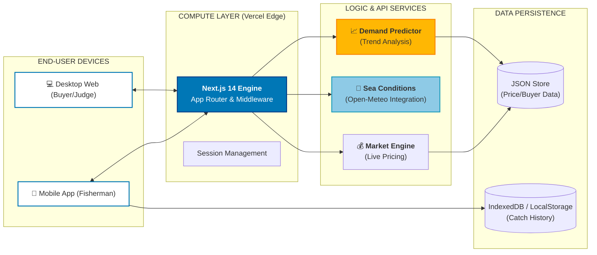
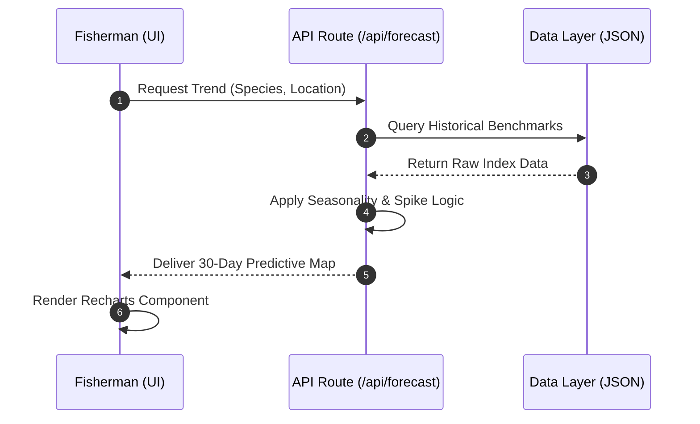

# FishConnect: Technical Architecture

This documentation is designed for the Final Pitch, highlighting the scalable, resilient, and data-driven nature of the FishConnect ecosystem.

## 1. System Ecosystem (High-Level)
This diagram illustrates the "Zero-Broker" flow between the landing and the laptop.

## 2. Real-time Predictive Flow
How the **Demand Predictor** calculates trends for the fisherman.

## 3. Tech Stack Deep-Dive (Hackathon Pitch)

- **Frontend**: Next.js 14 (App Router) + Tailwind CSS + Framer Motion.
- **Data Engine**: Serverless JSON API for blazing-fast read operations (optimized for high concurrency).
- **Visualization**: Recharts for dynamic time-series predictive modeling.
- **External Intelligence**: Integrated Open-Meteo API for real-time safety and navigation data.
- **Deployment**: Vercel CI/CD pipeline with Singapore (SIN1) region optimization for minimal latency in Asia.
